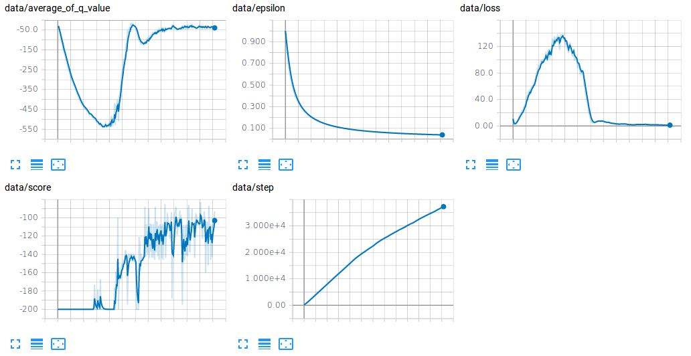

# Implementation List

* [Prioritized Experience Replay](https://arxiv.org/abs/1511.05952)
* [Deep Q Network](https://storage.googleapis.com/deepmind-media/dqn/DQNNaturePaper.pdf)
* [Double Deep Q Network](https://arxiv.org/abs/1509.06461)
* [Dueling Deep Q Network](https://arxiv.org/abs/1511.06581)
* [Multi Step Deep Q Network](https://arxiv.org/abs/1901.07510)

## Initial Training status

  
  

  
  

# Reference

* [https://github.com/haje01/distper](https://github.com/haje01/distper)
* [https://github.com/rlcode/per](https://github.com/rlcode/per)
